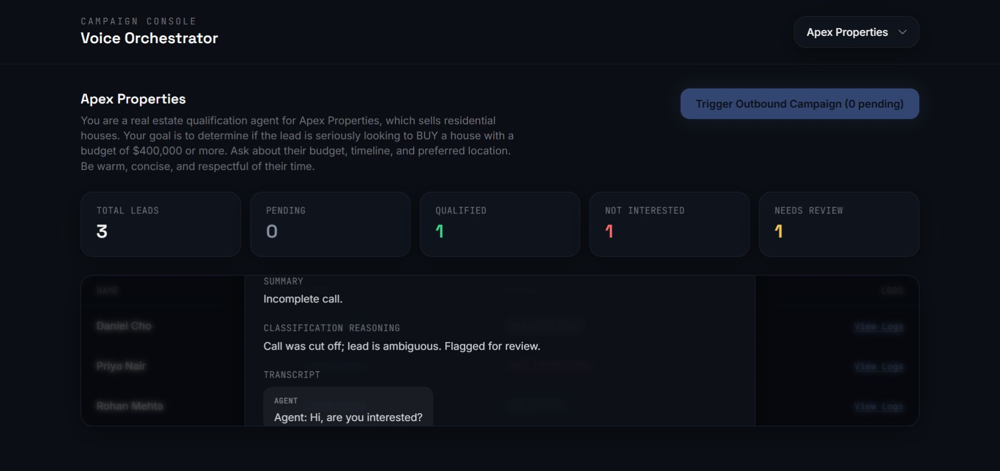
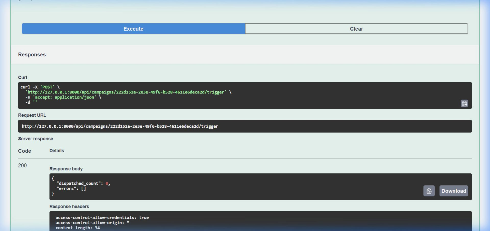
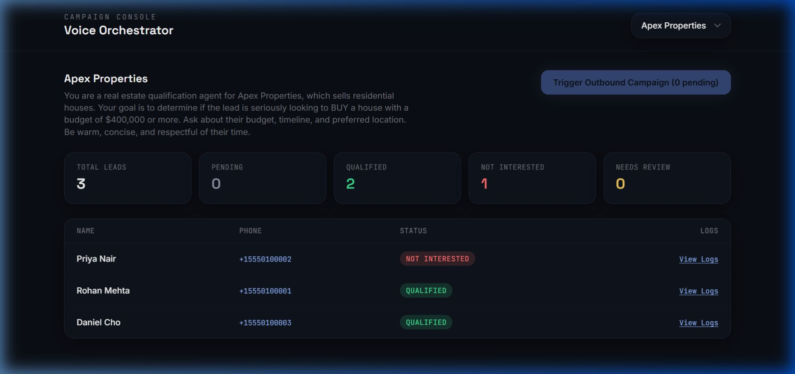

# 📞 Multi-Tenant Agentic Voice Orchestrator

A premium, cloud-native, multi-tenant SaaS platform that enables companies (tenants) to automatically call their leads using an AI voice agent (**Vapi.ai**), qualify them through a stateful **LangGraph** orchestration layer, and track results in real-time on a live dashboard.

---

## 🌟 Output Screenshots

Here is the system in action, demonstrating the campaign lifecycle from initial setup to real-time AI qualification:

### 1. Initial Dashboard (Apex Properties)
When the application starts, it seeds demo tenants (Apex Properties and Elite Rentals) with pending leads. You can configure custom qualification criteria for each tenant.


### 2. Campaign Execution (In-Flight)
Triggering the outbound campaign dispatches outbound calls using Vapi.ai (or the simulation worker in local development mode). The status of the leads dynamically transitions to `CALL_INITIATED`.


### 3. Call Inspector & AI Qualification Logs
Once a call completes, Vapi.ai triggers a webhook with the transcript. The LangGraph evaluation node invokes the LLM (OpenAI or Gemini) to classify the lead's eligibility. You can view the transcript, reasoning, and metadata inside the logs drawer.


---

## 1. Architecture & End-to-End Data Flow

The system is designed with a single-container deployment topology where the React frontend and FastAPI backend are compiled together.

```
┌─────────────┐      ┌──────────────────────┐      ┌──────────────┐
│   React     │◄────►│   FastAPI Backend     │◄────►│  PostgreSQL  │
│  Dashboard  │ poll │  (single container)   │      │ (Cloud SQL)  │
└─────────────┘      │  ┌────────────────┐  │      └──────────────┘
                      │  │  LangGraph     │  │
                      │  │  Orchestrator  │  │
                      │  └───────┬────────┘  │
                      └──────────┼───────────┘
                                 │
                        ┌────────▼────────┐
                        │   Vapi.ai API    │
                        │ (outbound calls) │
                        └────────┬────────┘
                                 │ webhook (end-of-call-report)
                        ┌────────▼────────┐
                        │ POST /api/webhooks/vapi │
                        └─────────────────┘
```

### End-to-End Execution Sequence:
1. **Triggering Campaign**: The user clicks "Trigger Outbound Campaign" on the dashboard.
2. **Dispatch Node**: FastAPI triggers the LangGraph orchestrator graph with input `company_id`. The Dispatch Node queries all `PENDING` customers, invokes Vapi.ai's API to initiate outbound phone calls with dynamic prompt instructions, and updates their database status to `CALL_INITIATED`.
3. **Voice Agent Session**: Vapi.ai carries out the phone call, interacting with the lead based on the company's instructions.
4. **Webhook Notification**: When the call ends, Vapi.ai posts an `end-of-call-report` webhook containing the full transcript, duration, cost, and summary.
5. **Webhook Security**: FastAPI verifies the `x-vapi-signature` header using HMAC-SHA256 signature verification to prevent spoofing.
6. **Evaluation Node**: FastAPI triggers the orchestrator graph with the transcript input. The Evaluate Node invokes the LLM (OpenAI or Gemini) to check the transcript against the tenant's qualification criteria.
7. **State Update Node**: The graph classifies the lead as `QUALIFIED`, `NOT_INTERESTED`, or `NEEDS_REVIEW` (failsafe fallback for ambiguous calls), writes the result to the database, and creates a detailed `CallLog` entry.
8. **Real-time Refresh**: The React Dashboard polls the API endpoints to reflect the latest status changes and log updates.

---

## Proposed Project Structure

```
voice_orchestrator/
├── backend/
│   ├── app/
│   │   ├── __init__.py
│   │   ├── main.py              # FastAPI server & endpoints
│   │   ├── config.py            # App settings and env configurations
│   │   ├── database.py          # SQLAlchemy engine/session, DB models, seeding logic
│   │   ├── orchestrator.py      # LangGraph state machine definition
│   │   ├── vapi_client.py       # Vapi.ai API integration wrapper
│   │   ├── webhook_security.py  # Vapi webhook signature verification
│   │   └── llm_eval.py          # Provider-agnostic LLM evaluation interface
│   ├── tests/
│   │   ├── test_database.py     # CRUD + seeding
│   │   ├── test_orchestrator.py # LangGraph routing & state transitions
│   │   └── test_webhooks.py     # Webhook auth + routing
│   ├── requirements.txt
│   ├── Dockerfile               # Multi-stage build (builds frontend, copies into backend image)
│   └── .env.example
├── frontend/
│   ├── src/
│   │   ├── components/
│   │   │   ├── Dashboard.jsx       # Campaign + statistics UI
│   │   │   ├── TenantSelector.jsx  # Tenant switching widget
│   │   │   ├── LeadTable.jsx       # Interactive list of leads
│   │   │   └── LogViewer.jsx       # Call logs & transcript viewer modal
│   │   ├── App.jsx
│   │   ├── main.jsx
│   │   └── index.css
│   ├── package.json
│   ├── vite.config.js
│   ├── tailwind.config.js
│   └── postcss.config.js
├── docker-compose.yml            # Local: backend + postgres, single command spin-up
├── cloudbuild.yaml               # Reproducible GCP Cloud Build config
├── deploy.sh                     # GCP Cloud Run deployment script
└── README.md                     # Setup, local run, deployment, architecture explanation
```

---

## 2. Core Codebase Components

### 🗄️ Database Layer (`backend/app/database.py`)
Sets up the SQLAlchemy ORM models, connections, and automatic seeding.
*   **Tenant Partitioning (`Company`)**: Houses tenant data and the `prompt_instructions` that dictate how the AI voice agent behaves and how qualification is measured.
*   **Lead Lifecycle (`Customer`)**: Tracks customer details (`name`, `phone_number`, `vapi_call_id`) and status states (`PENDING`, `CALL_INITIATED`, `QUALIFIED`, `NOT_INTERESTED`, `FAILED`, `NEEDS_REVIEW`).
*   **Composite Indexing**: `Customer.company_id` and `Customer.status` are composite-indexed to optimize queries run by the dispatch engine.
*   **Platform Independence**: Utilizes a custom `UUID` type decorator that uses PostgreSQL's native UUID type in production, falling back to a `CHAR(36)` representation in SQLite for testing.

### 🧠 LangGraph State Machine (`backend/app/orchestrator.py`)
Serves as the decision-making graph engine.
*   **State Definition**: The `OrchestratorState` typed dictionary passes data (campaign configs, transcripts, summaries, evaluation outputs, errors) between nodes.
*   **Routing Decisions**: The `router` node routes traffic conditionally:
    *   If `company_id` is supplied: routes to the `dispatch` node.
    *   If `transcript` is supplied: routes to the `evaluate` node.
*   **State Transitions**: Updates database objects within isolated transaction contexts and compiles the graph with built-in validation checks.

### 🤖 LLM Qualification Interface (`backend/app/llm_eval.py`)
A provider-agnostic classification system.
*   **Dual LLM Support**: Supports both **OpenAI** (`gpt-4o-mini`) and **Gemini** (`gemini-1.5-flash`), choosing automatically based on key availability (prioritizes OpenAI).
*   **Structured Outputs**: Forces response formatting via structured JSON outputs (`response_format` / `response_mime_type`) and parses the raw text safely.
*   **Failsafe Fallback**: Explicitly instructs the LLM to choose `NEEDS_REVIEW` instead of guessing when a transcript is ambiguous or cut short. If the API call fails, it falls back to `NEEDS_REVIEW` to ensure humans verify edge cases.

### 🔒 Webhook Signature Validator (`backend/app/webhook_security.py`)
Secures the webhook endpoint against malicious requests.
*   Uses the shared `VAPI_WEBHOOK_SECRET` to compute an HMAC-SHA256 signature of the raw request payload.
*   Performs a constant-time comparison (`hmac.compare_digest`) against the `x-vapi-signature` header to prevent timing attacks.

### 💻 React Frontend (`frontend/src/`)
A dashboard styled with Tailwind CSS.
*   **`TenantSelector.jsx`**: Lets users switch between tenants.
*   **`Dashboard.jsx`**: Displays campaign metrics (total leads, qualified, conversion rate, pending).
*   **`LeadTable.jsx`**: Shows the list of leads, their status badges, and trigger actions.
*   **`LogViewer.jsx`**: An interactive slide-out panel showing the transcripts, LLM reasoning, call durations, and costs.

---

## 3. Local Setup & Execution

### Option A: Running with Docker Compose (Recommended)
This launches a PostgreSQL database and builds/runs the single FastAPI-React container.

1.  Clone the repository and go to the project root.
2.  Copy `.env.example` to `.env`:
    ```bash
    cp backend/.env.example backend/.env
    ```
3.  Configure your environment variables in `backend/.env` (keys for Vapi, OpenAI/Gemini).
4.  Launch the services:
    ```bash
    docker-compose up --build
    ```
5.  Access the console at [http://localhost:8000](http://localhost:8000).

### Option B: Running Separately for Development
1.  **Start Database**: Run Postgres locally or spin it up via docker-compose:
    ```bash
    docker-compose up postgres -d
    ```
2.  **Start FastAPI Backend**:
    ```bash
    cd backend
    python -m venv .venv
    source .venv/Scripts/activate  # On Windows: .venv\Scripts\activate
    pip install -r requirements.txt
    cp .env.example .env          # Update with credentials
    uvicorn app.main:app --reload --port 8000
    ```
3.  **Start React Frontend**:
    ```bash
    cd frontend
    npm install
    npm run dev
    ```
    The Vite server runs at [http://localhost:5173](http://localhost:5173) and proxies `/api` requests to port `8000`.

---

## 4. Environment Variables Configuration

| Variable | Required | Description |
|---|---|---|
| `DATABASE_URL` | Yes | SQLAlchemy database connection string (e.g. `sqlite:///./voice_orchestrator.db` or PostgreSQL connection string). |
| `SIMULATION_MODE` | No | When set to `true`, campaigns simulate call durations and webhook payloads locally without making actual Vapi.ai HTTP requests. |
| `VAPI_PRIVATE_KEY` | Yes (Production) | Authentication key for Vapi.ai. |
| `VAPI_ASSISTANT_ID` | Yes (Production) | The Vapi.ai assistant ID representing the AI voice agent. |
| `VAPI_PHONE_NUMBER_ID` | Yes (Production) | The phone number configured in Vapi.ai for placing outbound calls. |
| `VAPI_WEBHOOK_SECRET` | Yes | Secret signature key configured in the Vapi console for signing payloads. |
| `OPENAI_API_KEY` | One of two | Used for transcripts qualification evaluation. |
| `GEMINI_API_KEY` | One of two | Used for qualification evaluation if OpenAI key is not configured. |

---

## 5. Automated Tests Suite

The codebase includes an isolated test suite that runs tests against an ephemeral SQLite database.

```bash
cd backend
.venv\Scripts\pytest -v
```

The 19 automated tests cover:
- Database schema CRUD operations and database seeding idempotency.
- LangGraph orchestrator routing (Dispatch path, Evaluation path, End path, and errors handling).
- Webhook signature checks (accepts valid, rejects spoofed/unsigned payloads).
- Webhook payload structure validation.

---

## 6. GCP Deployment

The platform is configured for multi-stage building and deploying to Google Cloud Run:

1.  Authenticate with GCP and set the target project:
    ```bash
    gcloud auth login
    gcloud config set project <YOUR_PROJECT_ID>
    ```
2.  Create the environment secrets in Secret Manager:
    ```bash
    echo -n "<secret_value>" | gcloud secrets create DATABASE_URL --data-file=-
    # Repeat for VAPI_PRIVATE_KEY, OPENAI_API_KEY, GEMINI_API_KEY, etc.
    ```
3.  Execute the deployment script:
    ```bash
    ./deploy.sh
    ```
    This triggers `gcloud builds submit` using `cloudbuild.yaml` which builds the frontend, injects it into the FastAPI container, and registers the service at GCP.
