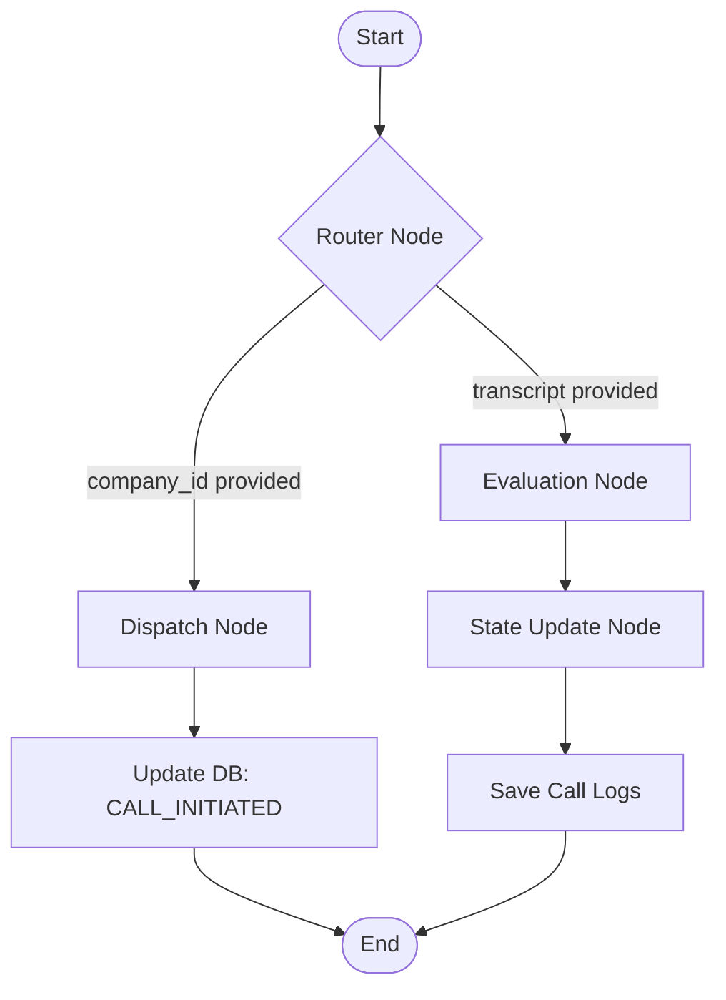

# Multi-Tenant Agentic Voice Orchestrator — Implementation Plan (Spec-Aligned)

This project is a Cloud-Native, Multi-Tenant SaaS platform for qualifying sales leads using
AI voice agents (Vapi.ai), stateful orchestration (LangGraph), and a web dashboard, deployed
to **GCP Cloud Run**.

---

## User Review Required

> [!IMPORTANT]
> - **API Keys Required**: To test outbound calling and evaluation end-to-end, you need a
>   **Vapi.ai Private API Key**, a **Vapi Assistant ID**, a **Vapi Phone Number ID**, and at
>   least one **LLM API Key** (`OPENAI_API_KEY` or `GEMINI_API_KEY`; `ANTHROPIC_API_KEY`
>   supported via the same interface if provided).
> - **Database**: **PostgreSQL** for both local development and production. Locally this runs
>   via `docker-compose` (a `postgres:16` container) so setup is still a single command —
>   no manual install required. In production it points at **GCP Cloud SQL (PostgreSQL)**.
>   This satisfies the assignment's explicit technical constraint (MongoDB Atlas *or* Cloud
>   SQL/PostgreSQL) without a SQLite intermediate that wouldn't carry over to prod.
> - **Public Webhook Endpoint**: Vapi needs a public HTTPS endpoint. For local testing we
>   use `ngrok`. In production, the Cloud Run service URL itself is public and used directly
>   — no tunnel needed once deployed.
> - **Secrets**: All sensitive values (Vapi key, DB URL, LLM keys) are injected as environment
>   variables. For the deployed environment, the `deploy.sh` script wires these through
>   **GCP Secret Manager** rather than plaintext Cloud Run env vars, per the assignment's
>   secrets-management requirement.

---

## Resolved Decisions

> [!NOTE]
> - **Database**: PostgreSQL (Cloud SQL in production), chosen for natural fit with the
>   relational multi-tenant foreign-key structure (Company → Customer → CallLog).
> - **LLM for evaluation**: Supports OpenAI (`langchain-openai`) and Gemini
>   (`langchain-google-genai`) selected dynamically based on which API key is present, with
>   the evaluation node built against a provider-agnostic interface so Anthropic
>   (`langchain-anthropic`) can be dropped in the same way if a key is supplied later.

---

## Proposed Project Structure

```
voice_orchestrator/
├── backend/
│   ├── app/
│   │   ├── __init__.py
│   │   ├── main.py              # FastAPI server & endpoints
│   │   ├── config.py            # App settings and env configurations
│   │   ├── database.py          # SQLAlchemy engine/session, DB models, seeding logic
│   │   ├── orchestrator.py      # LangGraph state machine definition
│   │   ├── vapi_client.py       # Vapi.ai API integration wrapper
│   │   ├── webhook_security.py  # Vapi webhook signature verification
│   │   └── llm_eval.py          # Provider-agnostic LLM evaluation interface
│   ├── tests/
│   │   ├── test_database.py     # CRUD + seeding
│   │   ├── test_orchestrator.py # LangGraph routing & state transitions
│   │   └── test_webhooks.py     # Webhook auth + routing
│   ├── requirements.txt
│   ├── Dockerfile               # Multi-stage build (builds frontend, copies into backend image)
│   └── .env.example
├── frontend/
│   ├── src/
│   │   ├── components/
│   │   │   ├── Dashboard.jsx       # Campaign + statistics UI
│   │   │   ├── TenantSelector.jsx  # Tenant switching widget
│   │   │   ├── LeadTable.jsx       # Interactive list of leads
│   │   │   └── LogViewer.jsx       # Call logs & transcript viewer modal
│   │   ├── App.jsx
│   │   ├── main.jsx
│   │   └── index.css
│   ├── package.json
│   ├── vite.config.js
│   ├── tailwind.config.js
│   └── postcss.config.js
├── docker-compose.yml            # Local: backend + postgres, single command spin-up
├── cloudbuild.yaml               # Reproducible GCP Cloud Build config
├── deploy.sh                     # GCP Cloud Run deployment script
└── README.md                     # Setup, local run, deployment, architecture explanation
```

---

## Proposed Changes

### Component 1: Multi-Tenant Database Design (SQLAlchemy + PostgreSQL)

#### 1. Models
- **Company (Tenant)**
  - `id`: UUID (primary key)
  - `name`: String — e.g. "Apex Properties", "Elite Rentals"
  - `prompt_instructions`: Text — e.g. "Qualify buyers looking for 3+ bedroom houses, budget above $500k"
  - `created_at`: DateTime

- **Customer (Lead)**
  - `id`: UUID (primary key)
  - `company_id`: UUID, Foreign Key → `Company.id`
  - `name`: String
  - `phone_number`: String (E.164 format)
  - `status`: Enum — `PENDING`, `CALL_INITIATED`, `QUALIFIED`, `NOT_INTERESTED`, `FAILED`, `NEEDS_REVIEW`
  - `vapi_call_id`: String, nullable
  - `updated_at`: DateTime

- **Call Log**
  - `id`: UUID (primary key)
  - `customer_id`: UUID, Foreign Key → `Customer.id`
  - `transcript`: Text
  - `summary`: Text
  - `call_metadata`: JSONB — duration, cost, ended reason, etc.
  - `created_at`: DateTime

All foreign keys are indexed; `Customer.company_id` and `Customer.status` are indexed together
since the Dispatch Node's primary query is "all PENDING customers for company X."

#### 2. Seeding
On backend startup, if the `companies` table is empty, auto-seed:
- **Company A — "Apex Properties"**: sells houses, qualifies buyers with $400k+ budget. 3 mock customers (mixed statuses: `PENDING`, `PENDING`, `QUALIFIED`).
- **Company B — "Elite Rentals"**: rents luxury apartments, qualifies tenants seeking 12+ month leases. 3 mock customers (mixed statuses: `PENDING`, `PENDING`, `NOT_INTERESTED`).

This satisfies the spec's minimum (2 companies, 2–3 customers each) with enough status variety to demo the dashboard meaningfully on first run.

#### 3. Local Setup
`docker-compose.yml` starts a `postgres:16` container alongside the backend, so local dev requires zero manual database installation — `docker-compose up` is sufficient. `DATABASE_URL` is the single source of truth for the connection string in both local and deployed environments.

---

### Component 2: Vapi.ai Outbound Call Integration

`vapi_client.py` wraps `POST https://api.vapi.ai/call`, passing:
- The customer's phone number (E.164).
- `assistantOverrides.variableValues`: customer name, company name, and any company-specific qualification criteria — enables **dynamic prompting** (bonus requirement).
- `assistantOverrides.model.messages`: a dynamically constructed system prompt built from `Company.prompt_instructions`, so each tenant's agent speaks with that tenant's qualification logic without needing separate Vapi assistants per tenant.
- `metadata`: internal `customer_id` and `company_id`, so the webhook payload can be linked back to the correct row without a second DB lookup by phone number.

Errors (invalid number, Vapi API failure) are caught and logged; the customer's status is set to `FAILED` rather than left in an inconsistent `CALL_INITIATED` state.

---

### Component 3: Agentic Orchestration with LangGraph



**1. State Definition** (`TypedDict`)
- `company_id`: Optional[str]
- `customer_id`: Optional[str]
- `vapi_call_id`: Optional[str]
- `transcript`: Optional[str]
- `summary`: Optional[str]
- `evaluation_result`: Optional[dict] — `{status, reasoning}`

**2. Router Node**
Inspects the incoming state and routes to `Dispatch` (campaign trigger from frontend) or
`Evaluate` (webhook from Vapi) — keeping a single graph entry point for both flows rather
than two separate graphs, which keeps the orchestration logic centrally testable.

**3. Dispatch Node**
- Fetches all `PENDING` customers for `company_id`.
- For each, builds the dynamic system prompt from the company's `prompt_instructions`, calls `vapi_client`, and on success records `vapi_call_id`.
- Updates status to `CALL_INITIATED`.

**4. Evaluation Node**
- Receives `transcript` and `summary` from the webhook payload.
- Calls `llm_eval.py`, which dispatches to OpenAI or Gemini depending on which key is configured, with a structured prompt that:
  - Includes the company's original qualification criteria as context.
  - Forces structured JSON output: `status` (`QUALIFIED` / `NOT_INTERESTED` / `NEEDS_REVIEW`), `reasoning`, `summary`.
  - Explicitly instructs the model to choose `NEEDS_REVIEW` over guessing when the transcript is ambiguous, incomplete, or the lead's intent is unclear — this is what makes the human-in-the-loop bonus behaviorally real rather than just a schema value nobody triggers.

**5. State Update Node**
- Updates `Customer.status` from the evaluation result.
- Creates a new `CallLog` row with transcript, summary, and `call_metadata`.

This design directly answers the grading question *"does the agent evaluate transcripts intelligently rather than using hardcoded logic"* — there is no keyword-matching or regex classification anywhere; status is always an LLM judgment call, with an explicit abstention path.

---

### Component 4: Webhook Handler (Hardened)

- **Endpoint**: `POST /api/webhooks/vapi`
- **Signature Validation**: `webhook_security.py` verifies Vapi's webhook signature header against the raw request body using the shared secret (`VAPI_WEBHOOK_SECRET`), using a constant-time comparison (`hmac.compare_digest`) to prevent timing attacks. Requests with a missing or invalid signature are rejected with `401` **before** any payload parsing or DB write occurs.
- **Structural Validation**: After signature verification passes, the payload is validated against a Pydantic model to confirm it's an `end-of-call-report` event and contains the expected `metadata.customer_id`. Malformed payloads return `400` rather than failing silently.
- **Processing**: Only after both checks pass does the handler extract transcript/summary/metadata and invoke the LangGraph evaluation flow.

This replaces the earlier "signatures or structure" framing — both are now mandatory, sequential checks, which directly addresses the assignment's explicit grading criterion on webhook validation.

---

### Component 5: Lightweight Frontend Dashboard

React + Tailwind CSS:
1. **Aesthetics**: Dark mode, gradient accents, glassmorphism panels, subtle micro-animations on interactive elements.
2. **Tenant Selector**: Dropdown switching between seeded companies; updates all dependent views instantly.
3. **Analytics Banner**: Total Leads, Pending, Qualified, Not Interested, Needs Review — counts scoped to the active tenant only (explicit multi-tenant UI separation).
4. **Lead Table**: Status badges (color-coded per status), clickable phone numbers, "View Logs" action shown only when a `CallLog` exists for that lead.
5. **Campaign Action**: "Trigger Outbound Campaign" button invokes the Dispatch flow for all `PENDING` leads of the selected tenant only.
6. **Live Update**: 5-second polling scoped to the active tenant's leads, reflecting webhook-driven status changes without manual refresh.
7. **Log Viewer Modal**: Transcript with speaker separation (User vs. Agent), LLM summary, and the evaluation `reasoning` field — making the agent's decision auditable, not a black box.

---

### Component 6: Containerization & Cloud Deployment

**1. Dockerfile (multi-stage)**
- Stage 1: `node:20-alpine` — installs frontend deps, runs `vite build`.
- Stage 2: `python:3.11-slim` — installs backend deps, copies built frontend static assets into the FastAPI static directory, copies backend source.
- Result: a single container serving both API and frontend — one Cloud Run service, simpler IAM and networking than a two-service setup.

**2. `cloudbuild.yaml`**
Defines the build → push → deploy pipeline so the same deployment is reproducible via `gcloud builds submit` or CI, not just manual local steps.

**3. `deploy.sh`**
- Builds and pushes the image via Cloud Build.
- Deploys to Cloud Run with `--allow-unauthenticated` (required for Vapi's public webhook callback).
- Wires `DATABASE_URL`, `VAPI_PRIVATE_KEY`, `VAPI_WEBHOOK_SECRET`, and LLM keys from **GCP Secret Manager** into the Cloud Run service's environment — not plaintext flags — satisfying the secrets-management requirement explicitly.
- Prints the resulting public service URL, which is then registered as the Vapi assistant's webhook target.

---

## Verification Plan

### Automated Tests (`backend/tests/`)
- `test_database.py`: seeding idempotency, CRUD operations, FK integrity.
- `test_orchestrator.py`: Router correctly dispatches to Dispatch vs. Evaluate; Dispatch Node updates status/`vapi_call_id` correctly; Evaluation Node correctly maps each LLM output state to the right DB status, including the `NEEDS_REVIEW` abstention path.
- `test_webhooks.py`: rejects unsigned/incorrectly-signed requests (`401`); rejects malformed payloads (`400`); accepts and correctly routes a valid `end-of-call-report` payload.

### Manual Verification
1. `docker-compose up` — backend + Postgres running locally.
2. `ngrok http 8000` to expose the webhook endpoint; register that URL as the Vapi assistant's webhook target.
3. Trigger a real outbound call from the dashboard, answer on a personal phone, complete the qualification conversation.
4. Confirm the webhook is received, signature verified, LangGraph evaluation runs, and the dashboard status updates within one polling interval (≤5s).
5. Repeat against the deployed Cloud Run URL to confirm production parity before recording the demo video.

---

## Deliverables Checklist (per assignment)
- [ ] GitHub repository (public or private, link shared)
- [ ] Deployed frontend + backend URLs (Cloud Run)
- [ ] README.md: env var setup, local build/run steps, Dockerfile walkthrough, GCP deployment guide, LangGraph architecture explanation (nodes/edges/state)
- [ ] Demo video (3–5 min): tenant + pending leads view → trigger campaign → real phone call received → webhook hits Cloud Run → dashboard updates live
